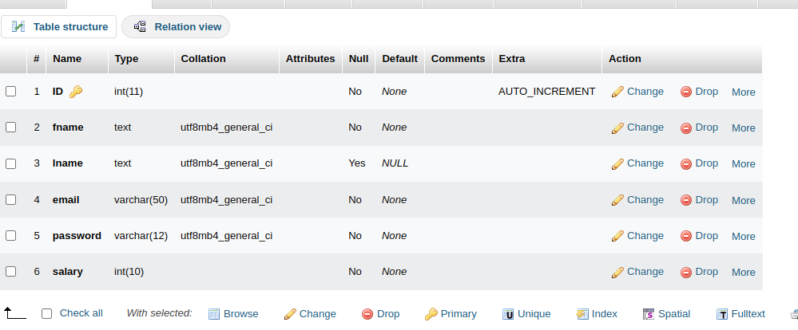

# Getting Started with Create React App

This project was bootstrapped with [Create React App](https://github.com/facebook/create-react-app).

## SETUP

Runs the app in the development mode.\
Open [http://localhost:3000](http://localhost:3000) to view it in your browser.

To start the flask backend ,
    open a new terminal in same directory . 
    cd backend/
    activate venv by 'venv/source/bin/activate' . 
    run the command 'npm run start-backend'.

    Also dont forget to install/import required dependencies/packages in venv. (Read the error message in terminal). 

MySQL server is needed as a database . 

Download xampp , start mySQL server . 
    Open [http://localhost/phpmyadmin] . 
    Create your database with name 'employee_details' . 
    Create a table in it with name 'basic' .
    Enter the column fields as follows : 
        

The page will reload when you make changes.\
You may also see any lint errors in the console.

